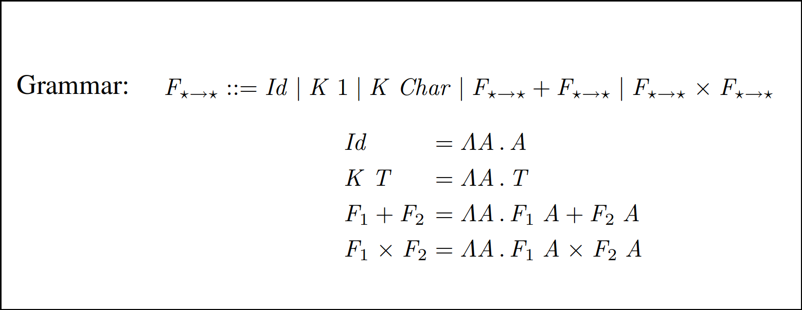

class: center, middle

# Handling Recursion in Generic Programming Using<br/>Closed Type Families¹

## Part I: Introduction to Datatype-Generic Programming

.large[
Presenter: [Anna Bolotina](http://annbolotina.github.io), ČVUT<br/>
ann-bolotina@yandex.ru
]

<p style="text-align:left">
<small>
<span style="font-family: Ubuntu Mono;">———————</span><br>
¹Based on <a href="https://annbolotina.github.io/papers/2018-unpb-dgp-recursion.pdf">joint work</a> with Artem Pelenitsyn
</small>
</p>
---

## What is generic programming about?

.large[
* The term may have different meanings for different people¹...

  - _parametric polymorphism_ (Generics in Java, C#; templates in C++)
  - _libraries of algorithms and data structures_ (the C++ STL)
  - _reflection and meta-programming_
  - ...

  (And what is your first association?)

* **Common idea:** Generic programming is about creating reusable functions and libraries to avoid code duplication.
]

<p style="text-align:left">
<small>
<span style="font-family: Ubuntu Mono;">———————</span><br>
¹Gibbons J. Datatype-Generic Programming. SSDGP 2007
</small>
</p>
---

## An OOP view on generic programming

### Motivation (I)

A non-generic function example (C#):
```c#
static bool Equal(BinTreeOfInts lhs, BinTreeOfInts rhs)
{
    return lhs == rhs
        || lhs != null && rhs != null
           && lhs.Value == rhs.Value
           && Equal(lhs.Left, rhs.Left)
           && Equal(lhs.Right, rhs.Right);
}
```

---

count: false

## An OOP view on generic programming

### Motivation (I)

A non-generic function example (C#):
```c#
static bool Equal(BinTreeOfInts lhs, BinTreeOfInts rhs)
{
    return lhs == rhs
        || lhs != null && rhs != null
           && lhs.Value == rhs.Value
           && Equal(lhs.Left, rhs.Left)
           && Equal(lhs.Right, rhs.Right);
}

static bool Equal(BinTreeOfChars lhs, BinTreeOfChars rhs)
{
    // Same as above — code duplication!
}
```

---

### Motivation (II)

Add genericity using C# Generics:

```c#
// Genericity by type (aka pаrametric polymorphism)
static bool Equal<T>(BinTree<T> lhs, BinTree<T> rhs)
{
    return lhs == rhs
        || lhs != null && rhs != null
           && lhs.Value.Equals(rhs.Value)
           && Equal(lhs.Left, rhs.Left)
           && Equal(lhs.Right, rhs.Right);
}
```

---

count: false

### Motivation (II)

Add genericity using C# Generics:

```c#
// Genericity by type (aka pаrametric polymorphism)
static bool Equal<T>(BinTree<T> lhs, BinTree<T> rhs)
{
    return lhs == rhs
        || lhs != null && rhs != null
           && lhs.Value.Equals(rhs.Value)
           && Equal(lhs.Left, rhs.Left)
           && Equal(lhs.Right, rhs.Right);
}

static bool Equal<T>(ListNode<T> lhs, ListNode<T> rhs)
{
    return lhs == rhs
        || lhs != null && rhs != null
           && lhs.Value.Equals(rhs.Value)
           && Equal(lhs.Next, rhs.Next);     // We need more genericity!
}
```

---

count: false

### Motivation (II)

Add genericity using C# Generics:

```c#
// Genericity by type (aka pаrametric polymorphism)
static bool Equal<T>(BinTree<T> lhs, BinTree<T> rhs)
{
    return lhs == rhs
        || lhs != null && rhs != null
           && lhs.Value.Equals(rhs.Value)
           && Equal(lhs.Left, rhs.Left)
           && Equal(lhs.Right, rhs.Right);
}

static bool Equal<T>(ListNode<T> lhs, ListNode<T> rhs)
{
    return lhs == rhs
        || lhs != null && rhs != null
           && lhs.Value.Equals(rhs.Value)
           && Equal(lhs.Next, rhs.Next);     // We need more genericity!
}                                            // Enhancement: we can use interfaces
```

---

### Solution using interfaces (I)

```c#
interface Encoding<NodeOfT, T> {
    List<T> Data();
    List<NodeOfT> Nodes();
}

class BinTree<T> : Encoding<BinTree<T>, T> {
    ...

    public List<T> Data() {
        T[] data = { Value };
        return new List<T>(data);
    }

    public List<BinTree<T>> Nodes() {
        BinTree<T>[] nodes = { Left, Right };
        return new List<BinTree<T>>(nodes);
    }
}

// Likewise, fоr ListNode<T>
```

---

### Solution using interfaces (II)

```c#
// Genericity by shape
static bool Equal<ContainerOfT, T>(ContainerOfT lhs, ContainerOfT rhs)
    where ContainerOfT : Encoding<ContainerOfT, T>
{
    return lhs != null && rhs != null
        && (lhs.Equals(rhs)
            || lhs.Data()
                  .Zip(rhs.Data(), (l, r) ⇒ l.Equals(r))
                  .All(x ⇒ x)
                && lhs.Nodes()
                      .Zip(rhs.Nodes(), (l, r) ⇒ Equal<ContainerOfT, T>(l, r))
                      .All(x ⇒ x))
        || lhs == null && rhs == null;
}
```
--
.small[
* Using such **encoding** is something similar to datatype-generic programming.

* This is simple, somewhat ad-hoc encoding: obviously it doesn't cover all possible types.
]
--
.small[
* Some problems that arise in OOP: support for encapsulation, subtyping, ... (Moors et al., 2006)
]

---

## Datatype-generic programming in Haskell

### Datatypes as algebraic sums of products

Here are examples of algebraic datatypes (ADTs) in Haskell:

```haskell
data Unit = Unit                                               -- 1
```
--
```haskell
data StudentStage = Freshman | Sophomore | Junior | Senior     -- 1 + 1 + 1 + 1
```
--
```haskell
           -- Person Name Age
data Person = Person String Int                                -- String × Int
```
--
```haskell
data Expr = NumLit Int                    -- μe. Int + Bool + e × e + e × e × e
          | BoolLit Bool
          | Add Expr Expr                 -- μ is the least fixed point operator
          | If Expr Expr Expr             -- in the modal μ-calculus
```

---

### Type-indexed datatypes (Hinze et al., 2002)

.center[]

---

### Polynomial functors

.center[]

---

### The Regular library

Representation combinators:

```haskell
data K a       r = K a                  -- Constant
data I         r = I r                  -- Identity (for recursion points)
data U         r = U                    -- Unit type
data (f :+: g) r = L (f r) | R (g r)    -- Sum of types
data (f :×: g) r = f r :×: g r          -- Product of types
```

---

count: false

### The Regular library

Representation combinators:

```haskell
data K a       r = K a                  -- Constant
data I         r = I r                  -- Identity (for recursion points)
data U         r = U                    -- Unit type
data (f :+: g) r = L (f r) | R (g r)    -- Sum of types
data (f :×: g) r = f r :×: g r          -- Product of types
```

Representing lists using Regular:

```haskell
instance Regular [a] where
--  Polynomial functor
--  type PF [a] :: * → *
    type PF [a] = U :+: ((K а) :×: I)
--  from :: [a] → PF [a] [a]
    from []      = L U
    from (h : t) = R (K h :×: I t)
--  to   :: PF [a] [a] → [a]
    to (L U)             = []
    to (R (K h :×: I t)) = h : t
```

---

### Generic functions using Regular (I)

_Example:_ Recursive subterms

```haskell
class RSubterms f where
--      Subterm T' of term T is its recursive subterm
--      if it has the same type as T.
--  Returns immediate recursive subterms of a given term.
    grsubterms :: f a → [a]

instance RSubterms U where
    grsubterms U     = []
instance Eq a ⇒ RSubterms (K a) where
    grsubterms (K _) = []
instance RSubterms I where
    grsubterms (I t) = [t]
instance (RSubterms f, RSubterms g) ⇒ RSubterms (f :+: g) where
    grsubterms (L t) = grsubterms t
    grsubterms (R t) = grsubterms t
instance (RSubterms f, RSubterms g) ⇒ RSubterms (f :×: g) where
    grsubterms (t₁ :×: t₂) = grsubterms t₁ ++ grsubterms t₂

rsubterms :: (Regular a, RSubterms (PF a)) ⇒ a → [a]
rsubterms t = grsubterms (from t)
```

---

### Generic functions using Regular (II)

_Example:_ Generic equality

```haskell
class GEq f where
    geq :: (a → a → Bool) → f a → f a → Bool

instance GEq U where
    geq _   U     U     = True
instance Eq a ⇒ GEq (K a) where
    geq _   (K x) (K y) = x == y
instance GEq I where
    geq eqf (I x) (I y) = eqf x y
instance (GEq f, GEq g) ⇒ GEq (f :+: g) where
    geq eqf (L x) (L y) = geq eqf x y
    geq eqf (R x) (R y) = geq eqf x y
    geq _   _     _     = False
instance (GEq f, GEq g) ⇒ GEq (f :×: g) where
    geq eqf (x₁ :×: y₁) (x₂ :×: y₂) = geq eqf x₁ x₂ && geq eqf y₁ y₂

eq :: (Regular a, GEq (PF a)) ⇒ a → a → Bool
eq x y = geq eq (from x) (from y)
```

---

### The generics-sop library .normal[(_Example:_ Representing expressions)]

```haskell
-- Type is represented аs "N-ary sum" оf "N-ary product",
--     whеre "N-ary sum"     is List оf Type,
--           "N-ary product" is List оf Type.

data Expr = NumLit Int | BoolLit Bool | Add Expr Expr | If Expr Expr Expr

instance Generic Expr where
--  type Code Expr :: [[*]]
    type Code Expr = '[ '[Int]
                      , '[Bool]
                      , '[Expr, Expr]
                      , '[Expr, Expr, Expr]]
--  from :: Expr → NS (NP I) (Code Expr)
    from (NumLit n)    = Z          (I n  :* Nil)
    from (BoolLit b)   = S (Z       (I b  :* Nil))
    from (Add e₁ e₂)    = S (S (Z    (I e₁  :* I e₂ :* Nil)))
    from (If e₁ e₂ e₃)  = S (S (S (Z (I e₁  :* I e₂ :* I e₃ :* Nil))))
--  to   :: NS (NP I) (Code Expr) → Expr
    to (Z          (I n  :* Nil))                     = NumLit n
    to (S (Z       (I b  :* Nil)))                    = BoolLit b
    to (S (S (Z    (I e₁  :* I e₂ :* Nil))))           = Add e₁ e₂
    to (S (S (S (Z (I e₁  :* I e₂ :* I e₃ :* Nil)))))  = If e₁ e₂ e₃

```

---

### Generic functions using generics-sop (I)

_Example:_ Generic equality

```haskell
geq :: (Generic a, All2 Eq (Code a)) ⇒ a → a → Bool
geq a b = go (from a) (from b)
  where
    go :: All2 Eq xss ⇒ NS (NP I) xss → NS (NP I) xss → Bool
    go (Z xs)  (Z ys)  = (and ∘ collapse_NP) (czipWith_NP p eq xs ys) -- This uses generics-sop's
                                                                      -- high-level traversal
    go (S xss) (S yss) = go xss yss                                   -- combinators
    go _       _       = False
    p  :: Proxy Eq
    p = Proxy
    eq :: Eq a ⇒ I a → I a → K Bool a
    eq (I a) (I b) = K (a == b)
```
--
```haskell
-- Collapses a homogeneous product to a list
collapse_NP :: NP (K a) xs → [a]

-- Zips two products using a given constrained function
czipWith_NP :: (All c xs, SingI xs)
             ⇒ Proxy c → (∀a. c a ⇒ f a → g a → h a) → NP f xs → NP g xs → NP h xs
```

---

count: false

### Generic functions using generics-sop (I)

_Example:_ Generic equality

```haskell
geq :: (Generic a, All2 Eq (Code a)) ⇒ a → a → Bool
geq a b = go (from a) (from b)
  where
    go :: All2 Eq xss ⇒ NS (NP I) xss → NS (NP I) xss → Bool
    go (Z xs)  (Z ys)  = (and ∘ collapse_NP) (czipWith_NP p eq xs ys) -- This uses generics-sop's
                                                                      -- high-level traversal
    go (S xss) (S yss) = go xss yss                                   -- combinators
    go _       _       = False
    p  :: Proxy Eq
    p = Proxy                               -- Usage, given a type T having a Generic instance:
    eq :: Eq a ⇒ I a → I a → K Bool a     --     instance Eq T where
    eq (I a) (I b) = K (a == b)             --       (==) = geq
```

```haskell
-- Collapses a homogeneous product to a list
collapse_NP :: NP (K a) xs → [a]

-- Zips two products using a given constrained function
czipWith_NP :: (All c xs, SingI xs)
             ⇒ Proxy c → (∀a. c a ⇒ f a → g a → h a) → NP f xs → NP g xs → NP h xs
```

---

### Generic functions using generics-sop (II)

_Non-working example:_ Recursive subterms

```haskell
rsubterms :: Generic a ⇒ a → [a]
rsubterms = rsubtermsNS ∘ from

rsubtermsNS :: NS (NP I) xss → [a]
rsubtermsNS (S ns) = rsubtermsNS ns
rsubtermsNS (Z np) = rsubtermsNP np

rsubtermsNP :: NP I xs → [a]
rsubtermsNP (I y :∗ ys) = ?   -- The result depends on the type of y
rsubtermsNP Nil = []
```

---

count: false

### Generic functions using generics-sop (II)

_Non-working example:_ Recursive subterms

```haskell
rsubterms :: Generic a ⇒ a → [a]
rsubterms = rsubtermsNS ∘ from

rsubtermsNS :: NS (NP I) xss → [a]
rsubtermsNS (S ns) = rsubtermsNS ns
rsubtermsNS (Z np) = rsubtermsNP np

rsubtermsNP :: ∀a xs. NP I xs → [a]
rsubtermsNP (I y :∗ ys)
    | typeOf @a y = castEq y : rsubtermsNP ys
    | otherwise   = rsubtermsNP ys
rsubtermsNP Nil = []
```

---

## References

.large[
* Datatype-Generic Programming // _J. Gibbons_, SSDGP 2007

* An Object-Oriented Approach to Datatype-Generic Programming // _A. Moors et al._ WGP 2006

* Type-indexed datatypes // _R. Hinze et al._ MPC 2002

* True sums of products // _E. de Vies and A. Löh_, WGP 2014

* Generic programming with fixed points for mutually recursive datatypes // _A.R. Yakushev et al._ ICFP 2009
]
